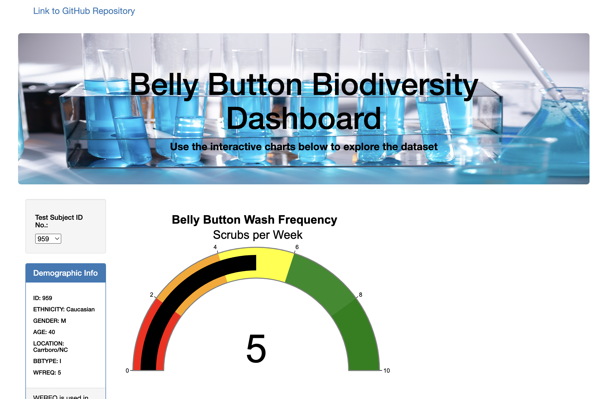
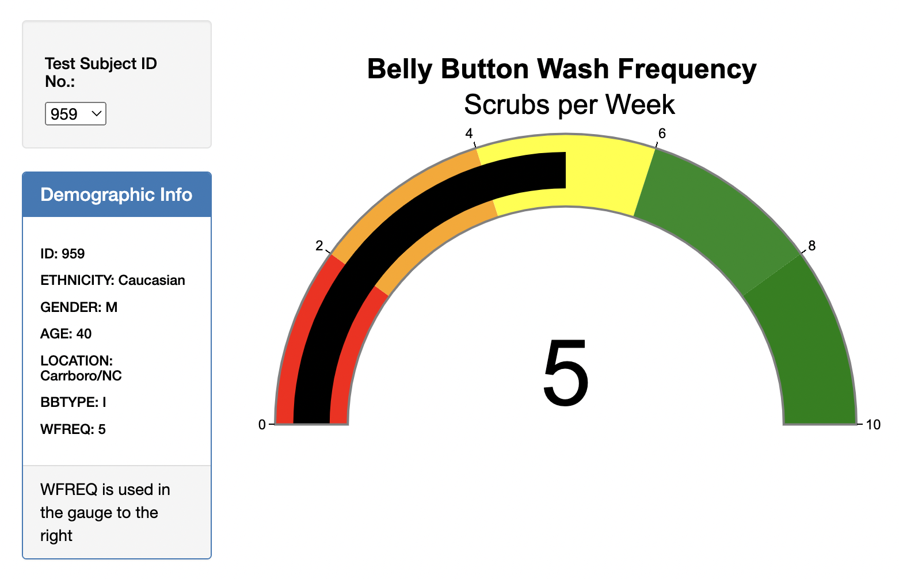
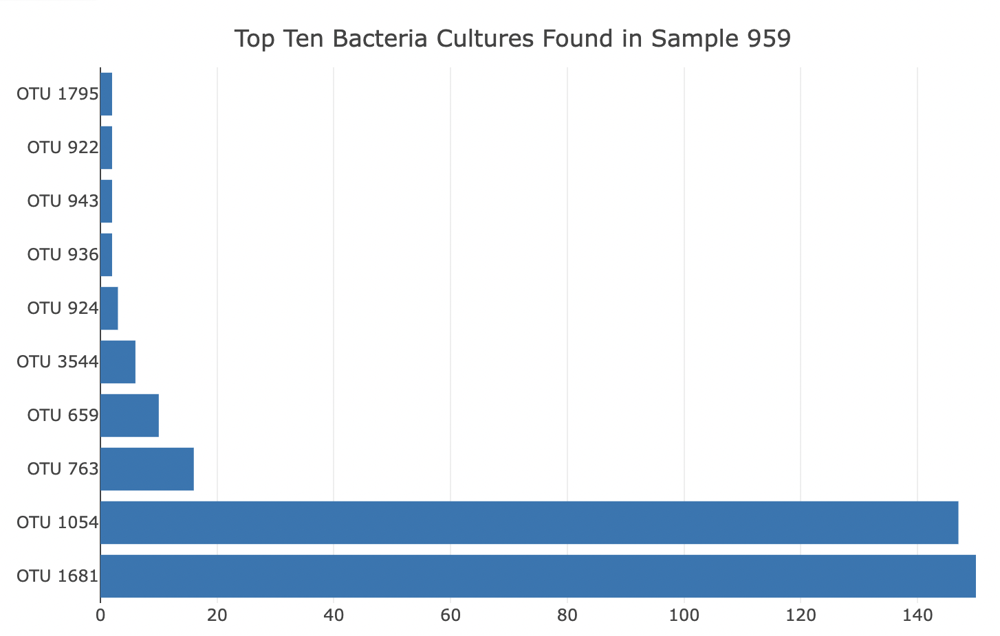
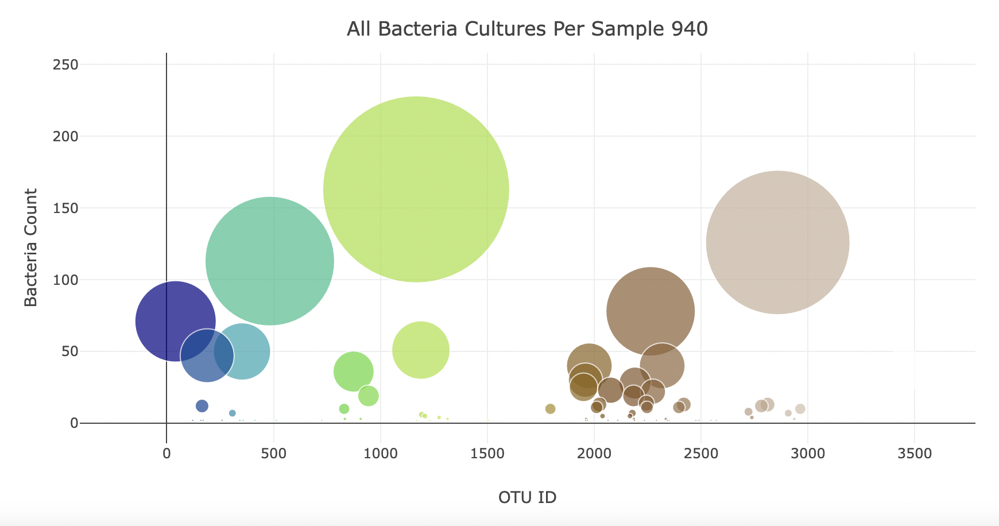

# belly_button_biodiversity

[Deploy Webpage](https://bishopce16.github.io/belly_button_biodiversity/)

## Overview of Project  

The purpose of this project is an exploration of bacteria culture data with JavaScript, Plotly, Bootstrap, D3.js, HTML, and CSS. The data contains a population of 153 subjects/volunteers, and samples (bacteria cultures) from their bellybuttons. Creating an interactive dashboard to visualize the bacteria species from bacteria living on subject’s belly button for potential synthesis aimed at a beef-like taste for meat-less alternative.  Each test subject was given an ID number and may use their ID number from a dropdown menu to see a variety of data:
	* All Bacteria Cultures Found per Sample.
* Top Ten Bacteria Cultures Found per Sample.
* Demographic Information
* Belly Button Wash Frequency (Scrubs per Week)
	

---

## Resource:

Data Sources: samples.json 

Tools: Visual Studio Code, HTML, JavaScript, Bootstrap, CSS 
 
---

## Results and Summary: 

The index.html file was deployed by GitHub pages for the ease of the users, the link is located above the overview of project section.  

The image of test tubes in the jumbotron was a free stock photo from 
, .  
 

The demographic information is directly under the pulldown tab to select the test subject id number. A foot note was added to the demographic info “WFREQ is used in the gauge to the right”. The gauge chart displays the belly button washing frequency value.  

 

The horizontal bar chart contains the top ten bacteria cultures found in the test subject’s sample.  

 

The bubble chart displays all bacteria cultures per the test subject’s sample.  

 

---
